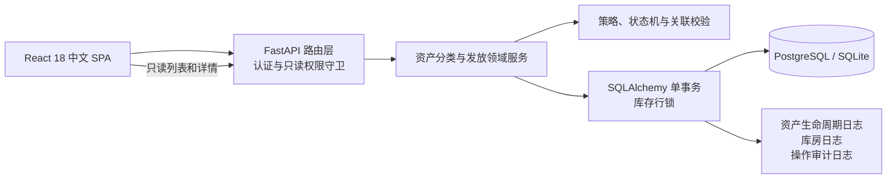
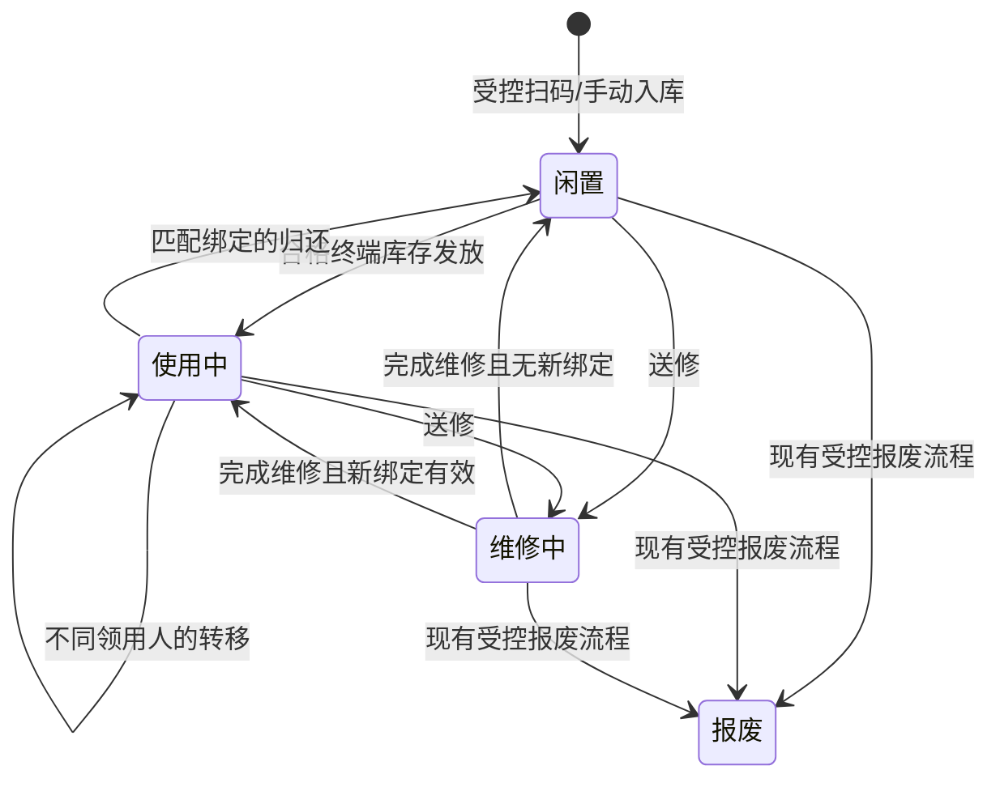

# Technical Design: Asset Category and Issuance Management

## Overview

本设计将系统收敛为三个互斥层级：逐台追踪的固定资产（仅台式机、笔记本电脑、平板电脑）、按数量领用的低值物品、按用途追踪的仓储物料。仓储物料统一采用受控“一级分类 + 二级分类”：八个一级分类作为汇总层，可维护二级分类作为细分层，每个活动物料必须引用一个存在且启用的从属组合。现有 `assets`、`warehouse_assets`、`asset_logs`、`operation_logs`、扫码工作台及 JWT/只读角色作为基础；新增受控分类目录、历史迁移隔离、受控入库、领域记录及事务服务，禁止单个分类文本继续作为活动物料的分类依据，也禁止通过通用库房入口临时建卡。

设计沿用 FastAPI 单体应用、SQLAlchemy 会话、Pydantic v2 与 React 18 SPA，不引入新的服务、状态管理框架或迁移工具。数据变更通过独立 `migrate_*.py` 脚本部署；所有业务时间继续使用 `models.china_now()` 的 UTC+8 无时区时间。

### 调研结论与依据

- `backend/models.py` 已提供固定资产、库房库存、资产/库房操作日志及全局操作日志；`main.py` 已有 `require_write_permission`、`create_operation_log` 和库存行锁范式，可作为新领域服务的基础。
- 现有 `/assets/` 允许直接建卡，`WarehouseAssetDetail.jsx` 采取“先扣库、再逐件建卡”的前端编排，且 `ReturnManagement.jsx` 通过名称匹配资产；这些路径不满足本规格的受控入口、标识唯一性和原子性，必须由新的后端事务接口替代。
- `ScanWorkstation.jsx` 已支持扫码和手动输入，`Warehouse.jsx` 已支持库房目录、筛选和低库存展示，适合扩展为受控入库及“一级分类 + 二级分类”仓储目录的中文入口。
- 实现遵循 [FastAPI 依赖注入](https://fastapi.tiangolo.com/tutorial/dependencies/) 与 [SQLAlchemy 会话事务](https://docs.sqlalchemy.org/en/20/orm/session_transaction.html) 的既有使用方式；以上外部文档仅用于阐明框架机制，业务结论来自本工作区代码。内容已为许可合规而转述。

## Architecture

- **路由层**继续置于 `backend/main.py`，按领域增加轻薄端点；端点只做 Pydantic 解析、身份注入、调用服务及 HTTP 错误映射。
- **领域服务层**新增为 `backend/asset_lifecycle_service.py`、`backend/material_issuance_service.py`、`backend/warehouse_category_service.py` 和 `backend/category_policy.py`。其中 `warehouse_category_service.py` 专门封装目录读取、维护、有效组合校验、迁移解决和分类审计；其余服务复用该有效组合校验，统一封装行锁读取、记录写入和审计写入，避免 React 或路由层拼接多步写操作。
- **持久层**继续使用 `models.py` 与 `schemas.py`。一次业务写操作在同一 SQLAlchemy 会话中完成；所有规定记录与审计日志均 `flush()` 成功后才 `commit()`，异常统一 `rollback()`。
- **表现层**在现有 `App.jsx` 路由与库房标签中增加中文子视图，统一经 Axios 调用领域端点；只读用户仅加载查询端点，服务端仍是最终权限边界。

## Components and Interfaces

### 分类策略与固定资产入库

`category_policy.py` 定义唯一常量：固定资产类别 `{台式机, 笔记本电脑, 平板电脑}`、八个仓储一级分类、领用策略 `{RETURNABLE, CONSUMABLE}`、固定资产状态 `{闲置, 使用中, 维修中, 报废}`。它将历史“移动设备”在读取、导入和迁移时规范化为“平板电脑”，并集中返回中文校验错误；非固定资产建卡请求返回“请改入低值领用或仓储物料”。

`POST /fixed-assets/inbound` 接受扫码或手动来源、品类、资产编号、序列号及选填品牌/型号/采购信息；仅允许三类固定资产，并以资产编号和序列号的唯一约束创建一张初始为“闲置”的资产卡和入库生命周期事件。扫码工作台批量提交使用 `POST /fixed-assets/inbound/batch`，每个序列号独立请求/独立事务，结果逐项返回，避免一个重复序列号阻断其他设备。

`POST /fixed-assets/{asset_id}/issue` 只从已绑定的“终端设备库存”发放一台已受控入库且状态为闲置的固定资产；请求要求领用人、工号、部门和发放日期。`POST /fixed-assets/{asset_id}/return`、`/transfer`、`/repair`、`/repair-complete` 分别实现归还、转移、送修和维修完成。所有状态切换与生命周期事件均由服务层执行，旧通用 `POST /assets/` 和库房详情“分配资产”不再用于这三类固定资产。

### 仓储受控两级分类目录

仓储分类由 `category_policy.py` 中的八个受控一级分类种子和数据库中的可维护二级分类共同组成，分类不再保存为单个名称。一级分类用于汇总，二级分类必须通过非空 `parent_id` 隶属于恰好一个一级分类；仓储物料只保存 `primary_category_id` 与 `secondary_category_id`，服务层和数据库复合外键共同验证二者是目录中存在且启用的有效组合。

分类读取接口如下：

- `GET /warehouse/categories`：返回启用的树形目录，一级节点包含其二级节点；`include_inactive=true` 仅供有写权限的维护人员查看停用项。
- `GET /warehouse/categories/primary`：返回一级分类平铺列表，供筛选与级联选择首列使用。
- `GET /warehouse/categories/primary/{primary_id}/secondary`：只返回指定一级分类下启用的二级分类，避免前端自行拼接从属关系。

分类维护接口为 `POST /warehouse/categories/primary`、`PATCH /warehouse/categories/primary/{id}`、`POST /warehouse/categories/secondary` 与 `PATCH /warehouse/categories/secondary/{id}`。一级分类代码、同级名称/代码不可重复；二级分类创建时必须提供有效一级分类。已被仓储物料或迁移映射引用的分类不得硬删除或直接换父级，只能停用；需要调整从属关系时创建新二级分类并在一个受审计事务中迁移引用。停用一级分类前必须确认其下不存在启用的二级分类，停用二级分类前必须确认不存在活动仓储物料引用。

### 仓储物料、低值物品及专业发放

`POST /warehouse/materials` 与 `PUT /warehouse/materials/{id}` 仅管理非固定资产物料；请求必须同时提交 `primary_category_id` 和 `secondary_category_id`，且只能引用启用的有效组合，并保存名称、可用库存、已分配数量、存放位置、低库存阈值及适用的领用策略。`GET /warehouse/materials` 支持名称、`primary_category_id`、`secondary_category_id`、可用/已分配数量、位置、阈值和低库存状态的 AND 组合筛选；同时提供一级和二级条件时先验证其从属关系，无效组合返回中文 400，而不是静默返回空集。响应同时包含稳定 ID 与一级/二级分类名称，并仅在可用数严格小于阈值时返回 `low_stock=true` 和“低库存预警”。`GET /warehouse/materials/{id}` 返回相同的双层分类结构供详情与编辑回填。

`POST /material-issues` 处理普通非固定资产发放；按目录策略创建互斥的待归还或一次性消耗记录。`POST /material-issues/{issue_id}/returns` 只允许待归还记录部分/全部归还。维修备件、网络机房耗材、IT 工具和办公通用耗材复用同一库存扣减事务，但提供语义明确的端点：`/repair-parts/issues`、`/network-consumables/issues`、`/tool-loans`、`/tool-loans/{id}/returns`、`/office-consumables/issues`。

### API contracts, permissions and frontend interfaces

所有查询端点依赖 `get_current_active_user`，因此只读用户可读取分类目录、仓储列表与详情。所有物料和分类维护端点依赖 `require_write_permission`；服务端是最终权限边界，前端隐藏按钮不能替代鉴权。分类维护成功响应包含目录项及审计标识；所有写端点返回涉及的主记录、库存摘要、领域记录标识和审计标识。错误返回中文 `detail` 及 400（格式、无效分类组合、状态或策略）、403（只读）、404（关联不存在）或 409（唯一性、分类被引用、并发库存或剩余数量冲突）。

每次分类新增、改名、排序、启用、停用或受控引用迁移都与 `operation_logs` 在同一 SQLAlchemy 事务提交，审计内容至少包含目录层级、目录项 ID、所属一级分类 ID、操作类型、经办人、UTC+8 时间及变更前后 JSON；审计失败时目录和物料引用全部回滚。读取操作不写业务审计，继续由现有访问日志策略处理。

前端新增/改造：`ScanWorkstation.jsx` 只显示三类固定资产并提交受控入库接口；`Warehouse.jsx`、`WarehouseSidebar.jsx` 与 `WarehouseAssetDetail.jsx` 采用“一级分类 + 二级分类”的展示和维护模式。创建/编辑表单先加载一级分类，未选择一级分类时禁用二级选择；选择一级分类后按该 ID 加载其二级分类，切换一级分类必须清空旧二级值，只有两项均有效才允许提交。编辑时先回填一级分类再加载并回填二级分类。列表和详情使用独立“一级分类”“二级分类”列/字段；筛选区支持一级单选、二级级联以及有效组合筛选，切换一级筛选时同步清空不再从属的二级筛选。只读用户可见双列数据和筛选，但不可见或不可用分类及物料写控件。其余新增 `MaterialIssueManagement.jsx`、`ToolLoanManagement.jsx`、`FixedAssetLifecycle.jsx` 等组件维持平铺 JSX 结构；全部标签、状态、提示与确认信息使用简体中文。

## Data Models

### 现有表扩展

| 表 | 扩展 | 约束与用途 |
|---|---|---|
| `assets` | `asset_category_code`、`inbound_source`、`terminal_inventory_id` | 仅在 `asset_category_code in (PC, NB, PD)` 且来源为 `SCAN`/`MANUAL` 时视为固定资产卡；`serial_number`、`fixed_asset_number` 为非空唯一；状态仅允许四值。旧“移动设备”迁移为“平板电脑”/`PD`。 |
| `warehouse_assets` | `primary_category_id`、`secondary_category_id`、`classification_status`、`legacy_category`、`material_kind`、`issue_policy`、`low_stock_threshold` | 活动记录必须引用一个有效一级/二级组合；迁移待处理记录标为 `PENDING_MIGRATION`、保留原分类且只读，不进入活动仓储目录。数量不变式为 `total_quantity = available_quantity + allocated_quantity`。兼容保留现有 `minimum_stock` 后迁移至新字段。 |
| `operation_logs` | 复用现有列 | 每次写操作保存操作类型、主资源、关联资源摘要、经办人、UTC+8 操作时间、前后变更 JSON（序列化为 `old_value`/`new_value`）。分类维护额外记录层级和父分类变化。 |

`warehouse_assets` 使用非空或条件检查约束：`classification_status='ACTIVE'` 时两个分类 ID 均非空；`classification_status='PENDING_MIGRATION'` 时分类 ID 为空、`legacy_category` 非空且记录禁止业务写操作。待处理记录保留原主键、库存、已分配数量、位置和其他非分类字段，管理员完成映射后在单事务中写入两个分类 ID、转为 `ACTIVE` 并关闭待处理项。这样活动仓储物料始终满足 Requirement 7.4，同时 Requirement 7.9 的历史不确定数据不会被猜测分类或丢失。

`assets` 的现有 `employee_name`、`employee_id`、`department` 和 `issue_date` 继续表达当前领用绑定，但不得作为历史唯一来源；操作只可由领域服务更新，禁止通用编辑端点绕过状态机。

### 受控分类目录表与数据库约束

| 表 | 关键字段 | 约束与关系 |
|---|---|---|
| `warehouse_primary_categories` | `id`, `code`, `name`, `is_active`, `sort_order`, `created_at`, `updated_at` | `code`、`name` 分别唯一且非空；初始种子为 Requirement 7.1 的八个一级分类。被引用时禁止删除。 |
| `warehouse_secondary_categories` | `id`, `primary_category_id`, `code`, `name`, `is_active`, `sort_order`, `created_at`, `updated_at` | `primary_category_id NOT NULL` 外键指向一级分类并采用 `ON DELETE RESTRICT`；`UNIQUE(primary_category_id, code)`、`UNIQUE(primary_category_id, name)`；另建 `UNIQUE(primary_category_id, id)` 作为有效组合的复合被引用键。每个二级分类因此必须且仅能隶属一个一级分类。 |
| `warehouse_category_mappings` | `id`, `normalized_legacy_category`, `primary_category_id`, `secondary_category_id`, `is_active`, `created_by`, `created_at` | 标准化后的历史单层值唯一；`(primary_category_id, secondary_category_id)` 使用与仓储物料相同的复合外键，保证映射目标是有效组合；映射变更必须审计。 |
| `warehouse_category_migration_issues` | `id`, `warehouse_asset_id`, `original_category`, `normalized_category`, `reason_code`, `reason_detail`, `status`, `resolved_by`, `resolved_at`, `created_at` | 每个未解决物料仅一条开放问题；`status ∈ {OPEN, RESOLVED}`。报告至少输出物料标识、原分类和值得处理原因。 |

`warehouse_assets.primary_category_id` 单独外键至 `warehouse_primary_categories.id`，并通过 `ForeignKeyConstraint([primary_category_id, secondary_category_id], [warehouse_secondary_categories.primary_category_id, warehouse_secondary_categories.id], ondelete='RESTRICT')` 验证组合。该复合约束防止“一级 A + 属于一级 B 的二级项”即使两个 ID 各自存在也被保存。服务层还要求两项均为启用状态，因为数据库外键只表达存在性；停用操作通过引用检查确保不会让活动物料失效。PostgreSQL 与启用 `PRAGMA foreign_keys=ON` 的 SQLite 测试库使用同一约束语义，所有外键和筛选列建立索引。

### 其他新增领域表

| 表 | 关键字段 | 约束与关系 |
|---|---|---|
| `fixed_asset_inbounds` | `id`, `asset_id`, `terminal_inventory_id`, `source`, `operator_id`, `inbound_at` | `asset_id` 唯一；`source ∈ {SCAN, MANUAL}`；保留每张卡的受控入库证明与源终端库存关联。 |
| `fixed_asset_issuances` | `id`, `asset_id`, `terminal_inventory_id`, `recipient_*`, `issued_at`, `operator_id` | 对当前发放建立关联；记录完整绑定快照，供追溯且不依赖后续资产字段。 |
| `asset_lifecycle_events` | `id`, `asset_id`, `event_type`, `previous_binding`, `new_binding`, `operator_id`, `occurred_at`, `metadata` | `event_type ∈ {ISSUE, RETURN, TRANSFER, REPAIR_SENT, REPAIR_COMPLETED, RETIRED}`；转移必须同时保存旧、新绑定。 |
| `material_issues` | `id`, `warehouse_asset_id`, `record_type`, `issue_policy`, `quantity`, `unreturned_quantity`, `consumed_completed`, `recipient_*`, `purpose`, `operator_id`, `issued_at` | `record_type ∈ {RETURNABLE, CONSUMABLE}`；待归还记录保存正的/零的余额，消耗记录 `consumed_completed=true` 且无归还余额；策略快照防止目录变更改写历史。 |
| `material_returns` | `id`, `material_issue_id`, `quantity`, `returned_at`, `operator_id` | 只关联 `RETURNABLE` 记录；`0 < quantity <=` 操作前未归还数量。 |
| `repair_part_issues` | `id`, `material_issue_id`, `target_asset_id`, `repair_order_ref`, `disk_serial_number` | 关联有效固定资产或有效维修单至少一个；硬盘 SN 可选。 |
| `network_consumable_issues` | `id`, `material_issue_id`, `department_id`, `project_ref`, `server_room_ref`, `work_order_ref` | 用途全部为空时允许；一旦填写，至少一个关联必须有效。 |
| `tool_loans` | `id`, `warehouse_asset_id`, `borrower_ref`, `quantity`, `unreturned_quantity`, `status`, `borrowed_at`, `expected_return_at`, `returned_at`, `tool_identifier`, `operator_id` | `status ∈ {BORROWED, RETURNED}`；部分归还仍为 `BORROWED`，余额为零时改为 `RETURNED`；贵重工具编号或二维码可选。 |

所有新增外键均建立索引；库存写入和资产状态读取使用 `SELECT … FOR UPDATE`（SQLite 测试以事务串行化覆盖等价情形）。

### 历史单层分类迁移

独立迁移脚本按以下可重复执行流程工作，不修改 `requirements.md` 定义的分类语义：

1. 在事务开始前备份并统计现有 `warehouse_assets` 行数、库存合计和非分类字段校验摘要，创建八个一级分类及管理员确认的二级分类种子。
2. 将历史分类执行去首尾空白、统一大小写/全半角和显式别名替换，使用 `warehouse_category_mappings.normalized_legacy_category` 做**唯一精确映射**；不使用模糊匹配猜测。
3. 若恰好命中一个启用的有效组合，则保留同一物料主键及所有库存、位置和非分类字段，只写入两个分类外键、保留 `legacy_category` 追溯值并标记 `ACTIVE`。
4. 若零命中、命中多个候选、映射目标停用或组合违反从属关系，则保留原记录与原分类，标记 `PENDING_MIGRATION`，并以 `UNMAPPED`、`AMBIGUOUS`、`INACTIVE_TARGET` 或 `INVALID_PAIR` 写入待处理报告。此类记录可查询和导出，但在解决前不能编辑、发放或参与活动目录统计。
5. 管理员通过受权限保护的解决操作选择有效组合；系统在一个事务中更新原物料、关闭报告项并写审计。重复运行迁移不会重复创建目录、报告或修改已解决记录。
6. 迁移后核对总记录数、各数量字段、位置和其他非分类字段摘要；任何核对失败回滚该批次。不会因分类迁移创建固定资产卡。

### 关键事务与状态机

1. 服务首先校验身份、策略、输入、关联和当前状态，再按稳定顺序锁定固定资产及相应 `warehouse_assets` 行；这样并发请求不会同时消费同一可用数量。
2. 成功路径依次更新主记录/库存、创建领域记录和生命周期记录、创建资产或库房日志、创建 `operation_logs`，每一步 `flush()`；仅全部成功时 `commit()`。
3. 任一校验失败、唯一约束冲突、库存不足或审计失败均抛出领域异常并调用 `rollback()`；响应不包含部分创建的标识。
4. 固定资产受控入库使终端库存总量和可用量各增加一；发放使可用量减一、已分配量加一；归还或维修完成至闲置时反向更新，以保持库存数量与闲置卡可发放数量可对账。报废与维修状态的库存影响通过同一服务显式记录，避免隐式 `_sync_warehouse_quantity` 按类别猜测目标行。

## Correctness Properties

*属性是应在所有有效系统执行中保持的特征或行为，即把人类可读的需求转化为可被机器验证的正确性保证。本功能的分类决策、两级目录从属关系、有效组合、迁移转换、状态机、库存算术、过滤和事务逻辑具有明确输入/输出及不变量，因此适合属性测试；固定菜单、级联控件、双列渲染、中文文案和认证接线使用示例或集成测试补充。*

### 属性反思

完成验收条件预分析后，对候选属性作如下去重与合并：

- 将固定资产分类范围、历史名称规范化、低值策略唯一性和办公耗材策略合并为**属性 1**，它们均由同一分类策略表决定。
- 将受控入库的成功构造与非法/非受控入口拒绝分为**属性 2–3**；成功和无副作用失败互不蕴含。
- 将固定资产生命周期成功转换与非法转换回滚分为**属性 4–5**，避免为每个事件重复定义相同原子性断言。
- 将低值发放验证、策略分支和归还余额分别保留为**属性 6–8**，因为它们验证不同的输入契约、记录互斥和逆向库存算术。
- 将 Requirement 7 拆成三个独立价值域：**属性 9**验证一级/二级从属及物料有效组合，**属性 10**验证组合筛选和严格低库存判定，**属性 11**验证历史迁移保真与待处理报告。固定八个一级分类、级联选择和双列展示属于确定 UI/API 示例，不重复包装成属性。
- 维修、网络、工具和办公物料各自保留一个属性（**属性 12–15**），因为关联和状态规则不同；所有领域及分类目录写操作的权限后置防御和审计同成同败统一由**属性 16**覆盖。

### Property 1: 分类、命名与领用策略受限

*For all（对于任意）* 品类名称、历史“移动设备”记录和仓储目录项，分类策略只会将台式机、笔记本电脑、平板电脑视为固定资产；历史名称会规范化为“平板电脑”；每个非固定目录项恰有一个允许策略，且办公与通用耗材只能是一次性消耗品。

**Validates: Requirements 1.1, 1.2, 1.4, 5.3, 5.5, 5.8, 11.1**

### Property 2: 受控固定资产入库创建唯一可追溯卡

*For all（对于任意）* 包含唯一非空资产编号与序列号的有效 PC、NB 或 PD 入库请求，且来源为扫码或手动输入，提交后恰创建一张关联该序列号的闲置固定资产卡、一条受控入库记录和一单位可用终端库存；卡的状态属于规定状态集合。

**Validates: Requirements 2.1, 2.2, 2.3, 2.7**

### Property 3: 非法或非受控固定资产建卡无副作用

*For all（对于任意）* 非固定品类、非受控入口、空白或重复标识、非法状态或无效必填字段，固定资产创建/入库操作被拒绝后，固定资产、终端库存及入库关联记录都与操作前相同，且非固定品类返回规定中文引导。

**Validates: Requirements 1.4, 2.4, 2.5, 2.8, 3.2, 5.2, 5.4**

### Property 4: 合法固定资产生命周期原子转换

*For all（对于任意）* 通过受控入库形成的有效固定资产及满足前置条件的命令，发放、归还、不同领用人转移、送修和维修完成都会一次性产生规定生命周期事件、状态和当前领用绑定；发放/归还还使关联终端库存的可用与已分配数量发生准确的一单位反向变化。

**Validates: Requirements 2.6, 3.1, 4.1, 4.2, 4.3, 4.4**

### Property 5: 非法固定资产生命周期操作完全回滚

*For all（对于任意）* 无效资产、非法源状态、不匹配归还绑定、相同转移领用人、无效维修完成绑定、库存不足、无效领用绑定或被注入的持久化故障，固定资产生命周期命令失败后，资产状态、当前绑定、终端库存和生命周期/发放记录均与操作前一致。

**Validates: Requirements 3.3, 4.5**

### Property 6: 非固定资产发放验证与可选信息保真

*For all（对于任意）* 非固定物料、库存和领用信息子集，发放仅在物料、正数量、日期时间、已登录经办人、库存和目录关联均有效时接受；任意已填写的领用人、工号、部门与用途均被原样保存，而所有这些补充字段均为空时不会单独导致拒绝。

**Validates: Requirements 6.1, 6.2, 6.3**

### Property 7: 低值发放按策略创建互斥记录并原子扣库

*For all（对于任意）* 库存充足且校验通过的低值物料发放，待归还策略恰创建一条余额等于发放数量的待归还记录，一次性消耗策略恰创建标记完成的消耗记录；两种记录类型互斥，且结构化发放记录和库存扣减与其在同一事务中提交。

**Validates: Requirements 6.4, 6.5, 6.6**

### Property 8: 待归还余额与消耗品禁止归还

*For all（对于任意）* 待归还记录和满足 `0 < return_quantity <= unreturned_quantity` 的归还量，归还会原子创建归还记录、将余额精确减少并等量回补库存；对于任意一次性消耗完成记录、超额/非正数量、无效关联或注入故障，归还被拒绝且所有记录和库存保持不变。

**Validates: Requirements 6.7, 6.8, 6.9, 6.10**

### Property 9: 两级分类从属与物料组合完整性

*For all（对于任意）* 受控分类目录和仓储物料创建/编辑命令，每个二级分类都有且仅有一个非空一级分类父项；一对一级/二级 ID 当且仅当二级项隶属该一级项且两项启用时是有效组合；每个活动仓储物料恰好引用一个有效组合。缺失 ID、交叉父级、停用项或不存在项的命令均被拒绝，物料与目录状态保持不变。

**Validates: Requirements 7.2, 7.3, 7.4, 7.5**

### Property 10: 两级组合筛选与严格低库存判定

*For all（对于任意）* 活动仓储物料集合及名称、一级分类、二级分类、数量、位置、阈值和低库存条件的任意子集，查询结果恰等于同时满足全部已指定条件的物料集合；同时指定一级和二级时二者必须构成有效组合；并且物料当且仅当 `available_quantity < low_stock_threshold` 时标识并显示“低库存预警”。

**Validates: Requirements 7.7, 7.10, 7.11, 11.5**

### Property 11: 历史单层分类迁移保真与待处理可追溯

*For all（对于任意）* 历史仓储物料及单层分类迁移映射，若标准化原分类恰好映射到一个启用的有效组合，迁移仅写入该一级/二级外键并保留主键、库存、已分配数量、位置和全部其他非分类字段；否则原分类及非分类字段保持不变，记录进入只读待处理状态，并恰有一条包含物料标识、原分类和明确原因的开放报告。重复执行迁移不会重复报告或改变已完成结果。

**Validates: Requirements 7.8, 7.9**

### Property 12: 维修备件用途关联与扣库原子性

*For all（对于任意）* 库存充足、字段完整的维修备件发放，若提供关联则其必须指向有效固定资产或维修单；成功操作保存发放记录（硬盘序列号可选）并精确扣库，任意无效关联、数量、库存或写入失败均不产生记录和库存变化。

**Validates: Requirements 8.1, 8.2, 8.3, 8.5**

### Property 13: 网络机房耗材用途关联与扣库原子性

*For all（对于任意）* 库存充足、字段完整的网络/机房耗材发放，可选用途为空时正常发放；一旦提供部门、项目、机房或工单中的任一关联，至少一个必须有效并被保存。成功时记录与库存扣减原子完成，任意无效输入或写入失败完全回滚。

**Validates: Requirements 9.1, 9.2, 9.3, 9.4**

### Property 14: 工具借还余额状态机

*For all（对于任意）* 合格工具借出请求，系统创建 `BORROWED` 记录、将未归还数量设为借出数量并扣减库存；对于任意合格的部分或全量归还，系统精确回补库存，部分归还保持 `BORROWED` 和正余额并创建关联的部分工具归还事件，全量归还转为 `RETURNED`。任意非法借还或故障不改变借用记录、部分工具归还事件和库存。

**Validates: Requirements 10.1, 10.2, 10.3, 10.4, 10.5, 10.7**

### Property 15: 办公耗材作为一次性消耗品原子发放

*For all（对于任意）* 库存充足且字段完整的办公与通用耗材发放，系统恰创建一条已完成的一次性消耗记录并按发放数量扣减库存；对于任意零、负数、缺字段、库存不足或写入失败，消耗记录与库存均保持不变。

**Validates: Requirements 11.2, 11.3, 11.4**

### Property 16: 所有业务及分类目录写操作与审计同成同败

*For all（对于任意）* 受支持业务写命令或一级/二级分类目录维护命令及其初始领域状态，若命令成功提交，则恰存在一条包含操作类型、关联记录、目录层级与父项（适用时）、经办人、UTC+8 操作日期和变更前后内容的审计日志；若审计写入失败，则目录、物料引用、业务记录、库存、状态、绑定和历史记录均恢复为操作前状态，且返回包含审计日志保存失败信息的中文错误提示。

**Validates: Requirements 12.2, 12.3**

## Error Handling

| 情形 | HTTP / UI 行为 | 数据完整性处理 |
|---|---|---|
| Pydantic 字段格式、分类 ID 缺失或字段缺失 | 422，返回中文字段错误 | 在服务调用前拒绝，无数据库写入。 |
| 一级/二级不从属、组合不存在、分类已停用、非法品类/策略/状态或业务前置条件 | 400，返回明确中文业务提示 | 不创建记录，不修改目录、物料、主记录或库存。 |
| 资产、一级/二级目录项、绑定、维修对象或借用记录不存在 | 404，返回中文提示 | 无写入。 |
| 目录代码/同级名称重复、被引用分类的删除/换父/停用、重复资产编号/SN、并发库存竞争、库存不足或余额冲突 | 409，返回中文冲突说明 | 回滚整笔事务；分类冲突提示先迁移引用或恢复有效从属关系。 |
| 待处理迁移记录参与编辑、发放或活动统计 | 409，返回“该物料分类待处理，请先完成一级和二级分类映射” | 保留原分类和全部非分类字段，不进入业务事务。 |
| 只读角色执行物料或分类维护 | 403，返回“只读账号无权限执行修改或新增操作”或等价中文提示 | 权限依赖在事务开始前拒绝，目录和物料均不变。 |
| 审计或其他持久化异常 | 500，记录服务端诊断日志但不暴露堆栈 | 捕获异常、`rollback()`；不得留下部分目录、引用或领域记录。 |

前端对 400/403/404/409/422 均在原表单附近显示后端中文 `detail`，保留用户输入以便修正；一级分类改变导致旧二级项失效时，前端立即清空二级值并要求重选。成功后刷新受影响的分类树、物料、库存和历史列表。前端不自行判断有效组合、不执行补偿性扣库或建卡：分类从属、外键和事务一致性均由后端保证。

## Testing Strategy

### 测试层次与工具

- **后端单元测试**：在 `backend/tests/` 中以 pytest 覆盖策略函数、状态机、Pydantic 模式、中文错误映射、分类标准化和迁移转换。实现阶段应在开发依赖中精确固定 `pytest==8.3.5` 与 `hypothesis==6.131.14`；不自行实现随机生成器框架。
- **属性测试**：使用 Hypothesis，全部 16 个属性各对应一个测试函数、每个最少 100 次生成。属性 9–11 生成多规模一级/二级目录、交叉父级组合、启停状态、物料集合、筛选条件、历史单层值和映射冲突；其他属性继续覆盖状态机、库存与审计。测试以 SQLite 临时数据库（启用外键）或事务 mock 隔离外部 I/O，复合外键和库存行锁语义另由 PostgreSQL 集成用例确认。每个测试必须用注释标记：`Feature: asset-category-and-issuance-management, Property N: <属性原文摘要>`。
- **API 集成测试**：使用 FastAPI `TestClient`、临时数据库和 JWT 角色夹具；覆盖分类树/平铺读取、一级/二级新增修改启停、物料有效组合校验、双分类响应、组合筛选、事务提交/回滚、唯一/引用约束和只读令牌。对 PostgreSQL 补充复合外键拒绝交叉组合及两个并发库存请求的代表性测试。
- **前端组件/流程测试**：为既有 Vite 项目补充 React Testing Library 与 Vitest 的精确版本开发依赖（实现阶段确定锁文件）；验证一级选择后才加载/启用二级选择、切换一级清空二级、编辑回填顺序、列表与详情双列展示、一级/二级组合筛选、中文错误、严格低库存文案和只读维护按钮隐藏。对页面布局使用少量快照，不将 CSS 视觉细节纳入属性测试。
- **迁移测试**：在隔离数据库副本执行脚本两次，分别验证唯一映射、零映射、歧义、停用目标和无效从属组合；比较迁移前后主键、记录数、库存、已分配数量、位置与其他非分类字段摘要，并验证待处理报告的原因和幂等性。

### 验收标准覆盖

| 测试类别 | 覆盖内容 |
|---|---|
| 属性测试 | 属性 1–16；特别以属性 9 验证二级唯一父项、复合外键和创建/编辑拒绝，以属性 10 验证一级/二级 AND 组合筛选与低库存边界，以属性 11 验证迁移保真、报告完整和重复执行幂等，以属性 16 验证分类维护审计失败回滚。 |
| 单元示例 | 固定资产分类清单（1.3）、特定低值策略菜单（5.6–5.7）、八个一级分类种子（7.1）、硬盘 SN（8.4）、贵重工具标识（10.6）和零可选领用信息（6.3）。 |
| API 集成 | 分类目录读取/维护、有效组合与数据库约束（7.2–7.5）、列表详情双字段（7.6）、组合筛选（7.7）、非固定采购入库（5.1），以及只读账号的分类/资产/仓储/领用/归还/维修/工具查询和所有代表性写拒绝（12.4–12.5）。 |
| 前端流程 | 创建/编辑级联选择、切换父项清空、双列展示、一级和二级组合筛选（7.5–7.7）、简体中文界面（12.1）、固定资产受控入口、库房不建卡、错误提示和低库存展示。 |
| 迁移验证 | 历史“移动设备”规范化；历史仓储单层分类唯一映射至有效一级/二级组合；无法确定的记录保留原值和非分类字段、进入含标识/原分类/原因的待处理报告；解决操作及审计；迁移重复执行不重复改变数据（7.8–7.9）。 |
| 权限与审计 | 已登录用户可读取目录；只读用户不能创建、改名、排序、启停分类或解决迁移问题；每次分类维护保存父项和前后值，审计写入失败时分类及物料引用一起回滚（12.2–12.5）。 |

测试不修改生产数据；事务测试每例回滚，迁移测试仅在隔离副本运行。每次实现后至少运行后端目标 pytest、前端 Vitest 单次运行及 `npm run build`，并在 PostgreSQL 测试环境执行复合外键与库存竞争冒烟验证。
