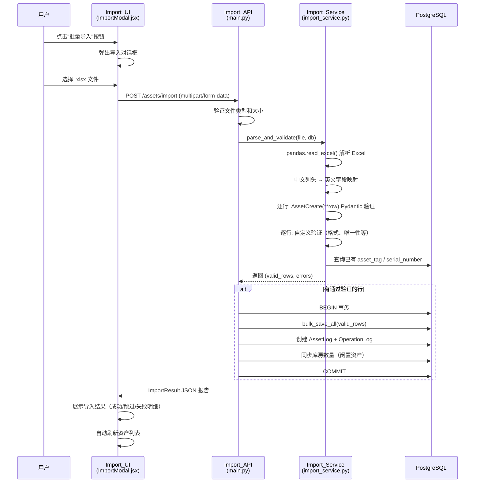
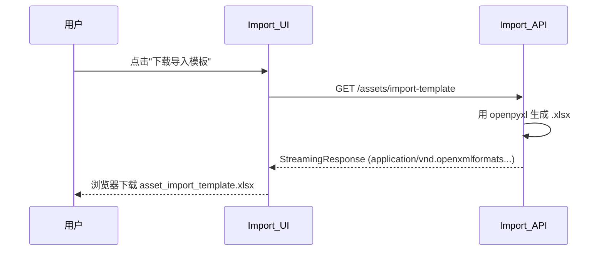
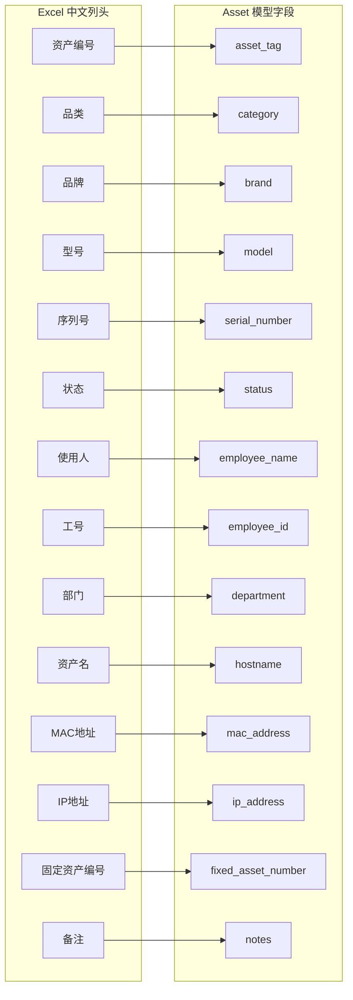

# 技术设计文档：资产数据导入

## 概述

本设计文档描述 IT 资产管理系统"资产数据导入"功能的技术实现方案。该功能允许用户上传 `.xlsx` 格式的 Excel 文件，系统自动解析中文列头、验证数据完整性（唯一性、合法性、必填项），并在数据库事务中原子性地批量写入资产记录。导入过程生成详细的 JSON 报告（含成功、跳过、失败的数量及原因），并与现有审计日志体系集成。

### 设计目标

1. **数据安全**：复用 `schemas.AssetCreate` Pydantic 模型进行逐行校验，确保与单条创建接口一致的验证规则
2. **原子性写入**：通过验证的记录在单个事务中写入，数据库错误时整体回滚
3. **用户友好**：中文列头映射、模板下载、详细的 JSON 结果报告反馈
4. **架构一致性**：遵循现有项目模式——路由在 `main.py`、模型在 `models.py`、Schema 在 `schemas.py`、前端组件平铺在 `components/`

### 设计决策

| 决策 | 选择 | 理由 |
|------|------|------|
| Excel 读取库 | `pandas` (`pd.read_excel`) | 一行代码即可将 Excel 转为 DataFrame，自动处理列头和数据类型，比 openpyxl 逐行读取更简洁高效 |
| Excel 模板生成库 | `openpyxl` | pandas 写 Excel 也需要 openpyxl 作为引擎，且 openpyxl 对模板格式（列宽、样式）控制更精细 |
| 数据验证策略 | 复用 `schemas.AssetCreate` Pydantic 模型 | 与单条创建接口 (`POST /assets/`) 共享同一套验证规则（含 `model_validator` 品类序列号必填检查），避免重复实现、保证一致性 |
| 额外自定义验证 | `asset_tag` 格式、唯一性、`status` 合法性、`serial_number` 唯一性等 | 这些验证 `AssetCreate` 不覆盖，需在 Pydantic 验证之外单独实现 |
| 文件上传方式 | FastAPI `UploadFile` | 框架原生支持，自动处理 `multipart/form-data`，内存友好 |
| 验证策略 | 先全量验证，再批量写入 | 避免部分写入后发现错误需要回滚的复杂场景 |
| 模板生成 | 服务端动态生成 | 无需维护静态文件，列头与映射表保持同步 |
| 前端文件选择 | 原生 `<input type="file">` + 自定义 UI | 与项目现有风格一致，无需引入额外组件库 |
| 导入结果展示 | Modal 内表格 | 复用现有 Modal 模式，用户无需离开当前页面 |

## 架构

### 整体数据流



### 模板下载流程



## 组件与接口

### 文件结构（新增/修改）

```
backend/
├── main.py                  # 新增 2 个路由: POST /assets/import, GET /assets/import-template
├── import_service.py        # 新增: Excel 解析（pandas）、验证（AssetCreate + 自定义）、批量写入逻辑
├── schemas.py               # 新增: ImportResult, ImportError 等 Schema
├── requirements.txt         # 新增: pandas, openpyxl 依赖
│
frontend/src/components/
├── ImportModal.jsx           # 新增: 导入对话框组件
├── Sidebar.jsx               # 修改: 添加"批量导入"按钮
```

### 后端接口

#### 1. `POST /assets/import` — 批量导入资产

```python
@app.post("/assets/import", response_model=schemas.ImportResult)
async def import_assets(
    file: UploadFile = File(...),
    db: Session = Depends(get_db),
    current_user: models.User = Depends(get_current_active_user)
):
    """
    接受 .xlsx 文件上传，解析并批量导入资产数据。
    
    验证流程:
    1. 文件类型检查（仅 .xlsx）
    2. 文件大小检查（≤ 10MB）
    3. pandas.read_excel() 解析列头与数据
    4. 中文列头映射为英文字段名
    5. 逐行: AssetCreate(**row_data) Pydantic 验证
    6. 逐行: 自定义验证（asset_tag 格式/唯一性、status 合法性、serial_number 唯一性等）
    7. 批量写入通过验证的记录
    
    返回: ImportResult JSON 报告（成功数、失败数、失败明细）
    """
```

**请求**: `multipart/form-data`，字段名 `file`

**响应**: `ImportResult` JSON

**错误码**:
- `400`: 文件类型错误 / 文件过大 / 缺少必填列头
- `401`: 未认证
- `500`: 数据库写入异常（事务已回滚）

#### 2. `GET /assets/import-template` — 下载导入模板

```python
@app.get("/assets/import-template")
async def download_import_template(
    current_user: models.User = Depends(get_current_active_user)
):
    """
    生成并返回包含正确中文列头和示例数据的 .xlsx 模板文件。
    使用 openpyxl 生成，支持列宽和样式控制。
    """
```

**响应**: `StreamingResponse`，Content-Type 为 `application/vnd.openxmlformats-officedocument.spreadsheetml.sheet`

### 后端服务模块: `import_service.py`

```python
import re
import io
import pandas as pd
from openpyxl import Workbook
from pydantic import ValidationError
from sqlalchemy.orm import Session

import models
import schemas

# ========== 列头映射表 ==========
COLUMN_MAPPING: dict[str, str] = {
    "资产编号": "asset_tag",
    "品类": "category",
    "品牌": "brand",
    "型号": "model",
    "序列号": "serial_number",
    "状态": "status",
    "使用人": "employee_name",
    "工号": "employee_id",
    "部门": "department",
    "资产名": "hostname",
    "MAC地址": "mac_address",
    "IP地址": "ip_address",
    "固定资产编号": "fixed_asset_number",
    "备注": "notes",
}

# 反向映射：英文字段名 → 中文列头（用于错误消息）
REVERSE_MAPPING: dict[str, str] = {v: k for k, v in COLUMN_MAPPING.items()}

REQUIRED_COLUMNS: set[str] = {"资产编号", "品类", "状态"}

VALID_STATUSES: set[str] = {"闲置", "使用中", "维修中", "报废"}

ASSET_TAG_PATTERN: re.Pattern = re.compile(r"^IT-\d{4}-\d{4}$")


def map_columns(chinese_header: str) -> str | None:
    """
    将中文列头映射为英文字段名。
    
    参数:
        chinese_header: 中文列头字符串
    
    返回:
        对应的英文字段名，若未知列头则返回 None
    """


def parse_excel(file_content: bytes) -> tuple[list[str], list[dict[str, str]]]:
    """
    使用 pandas.read_excel() 解析 Excel 文件内容。
    
    流程:
    1. pd.read_excel(io.BytesIO(file_content), dtype=str) 读取，所有列强制为字符串
    2. 检查必填列头是否存在
    3. 将中文列头映射为英文字段名，忽略未知列头
    4. 将 DataFrame 转为字典列表，NaN 值转为 None
    
    参数:
        file_content: 文件二进制内容
    
    返回:
        (mapped_headers, rows) — mapped_headers 为英文字段名列表，rows 为字典列表
    
    异常:
        ValueError: 缺少必填列头时抛出，消息中包含缺少的列头名称
        ValueError: pandas 无法解析文件时抛出
    """


def validate_rows(
    rows: list[dict[str, str | None]],
    db: Session
) -> tuple[list[dict], list[dict]]:
    """
    逐行验证数据，返回通过验证的行和失败日志。
    
    验证流程（每行按顺序）:
    1. 构建 row_data 字典，空字符串转为 None
    2. AssetCreate(**row_data) Pydantic 验证
       - 捕获 ValidationError，提取所有错误消息作为失败原因
       - 覆盖: 必填字段检查、品类相关 serial_number 必填检查
    3. 自定义验证（仅 Pydantic 通过后执行）:
       a. asset_tag 格式验证: IT-YYYY-NNNN
       b. asset_tag 文件内去重
       c. asset_tag 数据库唯一性
       d. status 合法性（strip 后检查，使用 ALL_VALID_STATUSES）
       e. serial_number 数据库唯一性（非空时）
       f. status 为"使用中"时 employee_name 必填
    
    参数:
        rows: parse_excel 返回的行数据列表
        db: 数据库 Session
    
    返回:
        (valid_rows, errors)
        - valid_rows: 通过所有验证的行数据字典列表
        - errors: 失败日志列表，每条包含 row_number, asset_tag, message
    """


def bulk_insert_assets(
    valid_rows: list[dict],
    db: Session,
    current_user: models.User
) -> int:
    """
    在单个事务中批量写入资产记录，并创建审计日志。
    
    对每条记录:
    1. 空字符串的唯一字段（serial_number, fixed_asset_number）转为 None
    2. 创建 Asset 实例并 add 到 session
    3. 创建 AssetLog（action="批量导入"）
    4. 如果 status 为"闲置"，调用 _sync_warehouse_quantity 同步库房
    
    最后创建一条 OperationLog 记录整次导入操作。
    
    参数:
        valid_rows: 通过验证的行数据
        db: 数据库 Session（调用方负责 commit/rollback）
        current_user: 当前操作用户
    
    返回:
        成功写入的记录数
    """


def generate_template() -> bytes:
    """
    使用 openpyxl 生成导入模板 .xlsx 文件的二进制内容。
    
    模板包含:
    - 第 1 行: 中文列头（与 COLUMN_MAPPING 的 key 一致）
    - 第 2 行: 示例数据
    
    返回:
        .xlsx 文件的 bytes
    """
```

### 验证流程详解

```mermaid
flowchart TD
    A[开始逐行验证] --> B[构建 row_data 字典]
    B --> C[空字符串 → None]
    C --> D{AssetCreate 验证}
    D -->|ValidationError| E[记录 Pydantic 错误消息]
    E --> F[标记为失败，跳到下一行]
    D -->|通过| G{asset_tag 格式<br/>IT-YYYY-NNNN?}
    G -->|不匹配| F
    G -->|匹配| H{asset_tag<br/>文件内重复?}
    H -->|重复| F
    H -->|唯一| I{asset_tag<br/>数据库已存在?}
    I -->|已存在| F
    I -->|不存在| J{status.strip()<br/>∈ 合法状态集?}
    J -->|不合法| F
    J -->|合法| K{serial_number 非空<br/>且数据库已存在?}
    K -->|已存在| F
    K -->|不存在或为空| L{status=使用中<br/>且 employee_name 为空?}
    L -->|是| F
    L -->|否| M[加入 valid_rows]
    M --> N[下一行]
    F --> N
```

### 前端组件

#### `ImportModal.jsx` — 导入对话框

```jsx
/**
 * 资产批量导入对话框
 * 
 * Props:
 *   onClose: () => void          — 关闭对话框
 *   onImportSuccess: () => void  — 导入成功后的回调（用于刷新资产列表）
 * 
 * 状态:
 *   file: File | null            — 用户选择的文件
 *   importing: boolean           — 是否正在导入中
 *   result: ImportResult | null  — 导入结果
 * 
 * 功能:
 *   1. 文件选择（仅 .xlsx）
 *   2. 下载导入模板
 *   3. 上传文件并显示导入结果
 *   4. 结果表格展示（成功数、失败数、失败明细）
 */
function ImportModal({ onClose, onImportSuccess }) { ... }
```

**UI 布局**:

```
┌─────────────────────────────────────────┐
│  批量导入资产                        ✕  │
├─────────────────────────────────────────┤
│                                         │
│  📥 下载导入模板                        │
│                                         │
│  ┌─────────────────────────────────┐    │
│  │  点击或拖拽上传 .xlsx 文件       │    │
│  │  (最大 10MB)                    │    │
│  └─────────────────────────────────┘    │
│                                         │
│  [已选择: example.xlsx]                 │
│                                         │
│  ── 导入结果 ──────────────────────     │
│  总行数: 100  成功: 95  失败: 5         │
│                                         │
│  ┌──────┬──────────┬──────────────┐     │
│  │ 行号 │ 资产编号  │ 失败原因     │     │
│  ├──────┼──────────┼──────────────┤     │
│  │  3   │ IT-2024..│ 资产编号已存在│     │
│  │  7   │ (空)     │ 缺少必填字段  │     │
│  └──────┴──────────┴──────────────┘     │
│                                         │
├─────────────────────────────────────────┤
│                    [取消]  [开始导入]    │
└─────────────────────────────────────────┘
```

#### `Sidebar.jsx` 修改

在侧边栏头部区域添加"批量导入"按钮：

```jsx
// 在 sidebar-header 区域的"共 N 个资产"旁边添加
<button className="btn btn-sm btn-primary" onClick={onImport}>
  批量导入
</button>
```

需要新增 `onImport` prop，由 `App.jsx` 传入，用于打开 `ImportModal`。

## 数据模型

### 现有模型（无需修改）

导入功能直接使用现有的 `Asset`、`AssetLog`、`OperationLog` 模型，无需新增数据库表或字段。

**Asset 模型关键字段**（导入涉及的）:

| 字段 | 类型 | 必填 | 唯一 | 说明 |
|------|------|------|------|------|
| `asset_tag` | String | ✅ | ✅ | 资产编号，格式 IT-YYYY-NNNN |
| `category` | String | ✅ | - | 品类 |
| `status` | String | ✅ | - | 状态（闲置/使用中/维修中/报废） |
| `brand` | String | - | - | 品牌 |
| `model` | String | - | - | 型号 |
| `serial_number` | String | 条件 | ✅ | 序列号（特定品类必填，由 AssetCreate model_validator 检查） |
| `employee_name` | String | 条件 | - | 使用人（使用中时必填） |
| `employee_id` | String | - | - | 工号 |
| `department` | String | - | - | 部门 |
| `hostname` | String | - | - | 资产名 |
| `mac_address` | String | - | - | MAC 地址 |
| `ip_address` | String | - | - | IP 地址 |
| `fixed_asset_number` | String | - | ✅ | 固定资产编号 |
| `notes` | Text | - | - | 备注 |

### 验证职责划分

| 验证规则 | 负责方 | 说明 |
|---------|--------|------|
| 必填字段（asset_tag, category, status） | `AssetCreate` Pydantic | 字段类型为 `str`（非 Optional），空值会触发验证错误 |
| 品类相关 serial_number 必填 | `AssetCreate.model_validator` | 已有 `validate_serial_number_by_category` 方法 |
| asset_tag 格式 IT-YYYY-NNNN | 自定义验证 | AssetCreate 不检查格式 |
| asset_tag 数据库唯一性 | 自定义验证 | 需查询数据库 |
| asset_tag 文件内去重 | 自定义验证 | 需跟踪已见的 asset_tag |
| status 合法性 | 自定义验证 | 复用 main.py 中的 `ALL_VALID_STATUSES` |
| serial_number 数据库唯一性 | 自定义验证 | 需查询数据库 |
| 使用中时 employee_name 必填 | 自定义验证 | AssetCreate 不检查此条件 |

### API 响应模型（新增 Schema）

```python
class ImportError(BaseModel):
    """单条导入失败记录"""
    row_number: int          # Excel 行号（从 2 开始，1 为列头）
    asset_tag: Optional[str] = None  # 该行的资产编号（如有）
    message: str             # 失败原因描述

class ImportResult(BaseModel):
    """导入结果 JSON 报告"""
    total_rows: int          # Excel 中的数据总行数（不含列头）
    success_count: int       # 成功写入数据库的行数
    failed_count: int        # 验证失败的行数
    errors: List[ImportError]  # 失败日志列表
    message: str             # 总结消息，如"成功导入 95 条，失败 5 条"
```

### 列头映射关系




## 正确性属性

*正确性属性是一种在系统所有合法执行中都应成立的特征或行为——本质上是对系统应做什么的形式化陈述。属性是人类可读规格说明与机器可验证正确性保证之间的桥梁。*

本功能的核心逻辑（pandas Excel 解析、列头映射、AssetCreate Pydantic 验证 + 自定义验证）是纯函数或具有清晰输入/输出行为的模块，非常适合属性基测试。以下属性覆盖了需求中所有可测试的验收标准。

### Property 1: 列头映射正确性

*For any* 有效的中文列头字符串（属于 COLUMN_MAPPING 的 key），`parse_excel` 使用 pandas 解析后返回的行数据字典应使用对应的英文字段名作为 key，且值与原始单元格内容一致。

**Validates: Requirements 2.1, 2.2**

### Property 2: 缺少必填列头检测

*For any* Excel 文件，若其列头集合缺少 {资产编号, 品类, 状态} 中的至少一个，`parse_excel` 应抛出错误，且错误消息中包含所有缺少的必填列头名称（不多不少）。

**Validates: Requirements 2.3**

### Property 3: 未知列头被忽略

*For any* Excel 文件，若其列头包含所有必填列头以及任意数量的未知列头，`parse_excel` 应成功解析，返回的行数据字典中仅包含已知映射的字段，不包含未知列头对应的数据。

**Validates: Requirements 2.4**

### Property 4: asset_tag 格式验证

*For any* 字符串 s，`validate_rows` 对 asset_tag 的格式验证应接受 s 当且仅当 s 匹配正则表达式 `^IT-\d{4}-\d{4}$`。不匹配时，失败日志应包含"资产编号格式错误，应为 IT-YYYY-NNNN"。

**Validates: Requirements 3.3, 3.4**

### Property 5: asset_tag 文件内去重

*For any* 包含 N 行数据的导入文件，若其中有 k 组重复的 asset_tag（每组 m_i 行），`validate_rows` 应仅接受每组的第一次出现，将后续 (m_i - 1) 行标记为失败，且失败消息中引用首次出现的行号。

**Validates: Requirements 3.2**

### Property 6: asset_tag 数据库唯一性

*For any* asset_tag，若该值已存在于数据库的未删除资产记录中，`validate_rows` 应将包含该 asset_tag 的行标记为失败，失败消息为"资产编号 {asset_tag} 已存在"。

**Validates: Requirements 3.1**

### Property 7: status 合法性验证（含空白字符处理）

*For any* 字符串 s，`validate_rows` 对 status 字段的验证应接受 `s.strip()` 当且仅当 `s.strip()` 属于 {闲置, 使用中, 维修中, 报废}。即：有效状态值加上任意前后空白仍应通过验证，而无效值无论是否有空白都应被拒绝。

**Validates: Requirements 4.1, 4.2, 4.3**

### Property 8: Pydantic 必填字段验证

*For any* 行数据，若 asset_tag、category、status 中任一字段为空或缺失，`AssetCreate(**row_data)` 应抛出 `ValidationError`，`validate_rows` 应将该行标记为失败。

**Validates: Requirements 5.1**

### Property 9: Pydantic 品类条件必填验证

*For any* 行数据，若 category 属于 {笔记本电脑, 台式机, 服务器, 移动设备} 且 serial_number 为空，`AssetCreate(**row_data)` 的 `model_validator` 应抛出 `ValidationError`，`validate_rows` 应将该行标记为失败，失败消息包含"序列号"相关描述。

**Validates: Requirements 5.2**

### Property 10: serial_number 数据库唯一性

*For any* 非空 serial_number，若该值已存在于数据库中，`validate_rows` 应将包含该 serial_number 的行标记为失败，失败消息为"序列号 {serial_number} 已存在"。

**Validates: Requirements 5.3**

### Property 11: 使用中状态要求使用人

*For any* 行数据，若 status 为"使用中"且 employee_name 为空，`validate_rows` 应将该行标记为失败，失败消息为"状态为「使用中」时，使用人为必填项"。

**Validates: Requirements 5.4**

### Property 12: 导入结果算术一致性

*For any* 导入操作的返回结果 `ImportResult`，以下等式应恒成立：`total_rows == success_count + failed_count`，且 `len(errors) == failed_count`。每条 error 应包含 `row_number`（≥2）和非空 `message`。

**Validates: Requirements 7.1, 7.2**

### Property 13: 仅验证通过的行被写入

*For any* 包含混合有效和无效行的导入文件，导入完成后数据库中新增的资产记录数应恰好等于 `success_count`，且每条新增记录的 asset_tag 都不在失败日志中出现。

**Validates: Requirements 7.3**

## 错误处理

### 文件级错误（立即返回，不进入逐行验证）

| 错误场景 | HTTP 状态码 | 错误消息 | 处理方式 |
|---------|------------|---------|---------|
| 文件扩展名非 .xlsx | 400 | "仅支持 .xlsx 格式文件" | 直接返回，不解析文件 |
| 文件大小超过 10MB | 400 | "文件大小不能超过 10MB" | 直接返回，不解析文件 |
| 缺少必填列头 | 400 | "缺少必填列头: {列头列表}" | pandas 解析列头后返回，不处理数据行 |
| Excel 文件损坏/无法解析 | 400 | "文件解析失败: {具体错误}" | 捕获 pandas 解析异常 |
| 文件无数据行（仅有列头） | 400 | "文件中没有数据行" | DataFrame 为空时返回 |

### 行级错误（记录到失败日志，不中断处理）

| 错误场景 | 失败消息模板 | 验证来源 |
|---------|------------|---------|
| Pydantic 必填字段缺失 | ValidationError 中的错误消息 | `AssetCreate` |
| 品类需要序列号但为空 | "品类为「{category}」时，序列号（serial_number）为必填项" | `AssetCreate.model_validator` |
| asset_tag 格式错误 | "资产编号格式错误，应为 IT-YYYY-NNNN" | 自定义验证 |
| asset_tag 数据库重复 | "资产编号 {asset_tag} 已存在" | 自定义验证 |
| asset_tag 文件内重复 | "资产编号 {asset_tag} 在文件中重复（首次出现于第 {行号} 行）" | 自定义验证 |
| status 非法 | "非法状态值「{status}」，允许: 闲置, 使用中, 维修中, 报废" | 自定义验证 |
| serial_number 数据库重复 | "序列号 {serial_number} 已存在" | 自定义验证 |
| 使用中但无使用人 | "状态为「使用中」时，使用人为必填项" | 自定义验证 |

### 事务级错误（回滚整个写入）

| 错误场景 | HTTP 状态码 | 处理方式 |
|---------|------------|---------|
| 数据库约束冲突（如并发插入导致唯一约束违反） | 500 | 回滚事务，返回具体错误信息 |
| 数据库连接异常 | 500 | 回滚事务，返回"数据库写入失败" |

### 错误处理流程

```python
# 伪代码：import_assets 路由中的错误处理
async def import_assets(file, db, current_user):
    # 1. 文件级验证
    if not file.filename.endswith('.xlsx'):
        raise HTTPException(400, "仅支持 .xlsx 格式文件")
    
    content = await file.read()
    if len(content) > 10 * 1024 * 1024:
        raise HTTPException(400, "文件大小不能超过 10MB")
    
    # 2. 用 pandas 解析 Excel
    try:
        headers, rows = parse_excel(content)
    except ValueError as e:
        raise HTTPException(400, str(e))
    
    if not rows:
        raise HTTPException(400, "文件中没有数据行")
    
    # 3. 逐行验证（AssetCreate Pydantic + 自定义验证）
    valid_rows, errors = validate_rows(rows, db)
    
    # 4. 批量写入（带事务保护）
    inserted_count = 0
    if valid_rows:
        try:
            inserted_count = bulk_insert_assets(valid_rows, db, current_user)
            db.commit()
        except Exception as e:
            db.rollback()
            raise HTTPException(500, f"数据库写入失败: {str(e)}")
    
    # 5. 返回 JSON 报告
    return ImportResult(
        total_rows=len(rows),
        success_count=inserted_count,
        failed_count=len(errors),
        errors=errors,
        message=f"成功导入 {inserted_count} 条，失败 {len(errors)} 条"
    )
```

## 测试策略

### 测试框架与工具

| 工具 | 用途 |
|------|------|
| `pytest` | 测试框架（项目已有） |
| `hypothesis` | 属性基测试库（Python 生态首选） |
| `httpx` | FastAPI TestClient 底层依赖（项目已有） |
| `pandas` | 测试中生成 Excel 文件（与生产代码一致） |
| `openpyxl` | 测试中生成 Excel 文件（模板测试） |

### 双轨测试方法

#### 属性基测试（Property-Based Tests）

使用 `hypothesis` 库，每个属性测试运行最少 100 次迭代。每个测试通过注释标注对应的设计属性。

**标注格式**: `# Feature: asset-data-import, Property {N}: {属性标题}`

**测试文件**: `backend/tests/test_import_properties.py`

**测试范围**:
- `parse_excel` 函数的列头映射逻辑（Property 1-3）
- `validate_rows` 函数的验证逻辑（Property 4-11），含 AssetCreate Pydantic 验证
- `ImportResult` 的算术一致性（Property 12）
- 端到端导入的正确性（Property 13）

**生成器策略**:
- 使用 `hypothesis.strategies` 生成随机的 Excel 行数据
- 为 asset_tag 创建自定义策略：有效格式 `IT-{4位年份}-{4位序号}` 和无效格式
- 为 status 创建策略：从合法值集合中选择（有效）或生成任意字符串（无效）
- 为 category 创建策略：从已知品类列表中选择
- 使用 `@settings(max_examples=100)` 确保最少 100 次迭代

#### 单元测试（Example-Based Tests）

**测试文件**: `backend/tests/test_import_unit.py`

| 测试用例 | 验证内容 | 对应需求 |
|---------|---------|---------|
| `test_reject_non_xlsx_file` | 非 .xlsx 文件返回 400 | 1.1, 1.2 |
| `test_reject_oversized_file` | 超过 10MB 文件返回 400 | 1.3 |
| `test_require_authentication` | 无认证返回 401/403 | 1.4 |
| `test_all_column_mappings` | 14 个列头全部正确映射 | 2.2 |
| `test_pandas_reads_all_as_string` | pandas 读取时所有列为字符串类型 | 2.1 |
| `test_pydantic_validation_error_captured` | AssetCreate ValidationError 被正确捕获并转为失败日志 | 5.1, 5.2 |
| `test_transaction_rollback_on_db_error` | 数据库错误时回滚 | 6.2, 6.3 |
| `test_success_returns_json_report` | 成功导入返回完整 JSON 报告 | 7.1 |
| `test_all_rows_fail_returns_zero` | 全部失败时 success_count=0 | 7.4 |
| `test_operation_log_created` | 导入后创建 OperationLog | 8.2 |
| `test_template_has_example_row` | 模板第二行有示例数据 | 10.3 |

#### 集成测试

**测试文件**: `backend/tests/test_import_integration.py`

| 测试用例 | 验证内容 | 对应需求 |
|---------|---------|---------|
| `test_full_import_flow` | 端到端：上传文件 → pandas 解析 → AssetCreate 验证 → 写入 → JSON 报告 | 6.1, 6.4, 7.1 |
| `test_import_with_idle_assets_syncs_warehouse` | 闲置资产导入后库房数量同步 | 8.3 |
| `test_asset_logs_created_for_each_import` | 每条导入资产都有 AssetLog | 8.1 |
| `test_template_download_and_reimport` | 下载模板 → 填数据 → 导入成功 | 10.1, 10.2 |

### 依赖项

需要新增的 Python 包：

| 包名 | 版本 | 用途 |
|------|------|------|
| `pandas` | `>=2.0.0` | Excel 文件读取（`pd.read_excel`） |
| `openpyxl` | `>=3.1.0` | pandas 读取 Excel 的引擎 + 模板生成 |
| `hypothesis` | `>=6.0.0` | 属性基测试 |

安装命令：
```bash
cd backend && pip install pandas openpyxl hypothesis
```

### 执行命令

```bash
# 执行所有导入相关测试
pytest backend/tests/test_import_properties.py backend/tests/test_import_unit.py backend/tests/test_import_integration.py -v

# 仅执行属性基测试
pytest backend/tests/test_import_properties.py -v

# 仅执行单元测试
pytest backend/tests/test_import_unit.py -v

# 仅执行集成测试
pytest backend/tests/test_import_integration.py -v
```